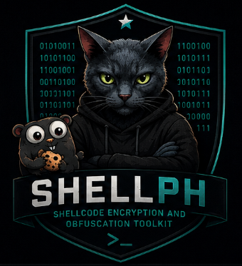

# Shellph


> **A shellcode encryption and obfuscation toolkit written in Go-Lang.**

Shellph is a portable command-line utility designed to automate encryption and obfuscation of arbitrary shellcode.

---

# Features

## Encryption

* AES-CBC (128/192/256-bit keys, PKCS#7 padding)
* RC4
* XOR (repeating key)

## Transformations

* IPv4
* MAC Address
* UUID

## Output Formats

* Binary
* Hex
* String
* Array

## Supported Languages

* C
* Go
* Rust
* C#
* PowerShell

## Additional Features
* Calculate Entropy of a given input file

---

# Installation

## Build from source

```bash
git clone https://github.com/xirtam2669/shellph.git
cd shellph

go build -o shellph ./cmd/shellph
```

## Install with Go

```bash
go install ./cmd/shellph
```

---

# Usage

```text
shellph [options]
```

## Options

| Short  | Long                       | Description                               |
| ------ | -------------------------- | ----------------------------------------- |
| `-f`   | `--file`                   | Input file                                |
| `-fmt` | `--input-format`           | `bin` or `hex`                            |
| `-op`  | `--operation`              | Encryption or transformation operation    |
| `-of`  | `--output-format`          | `bin`, `hex`, `string`, or `array`        |
| `-ofl` | `--output-format-language` | `c`, `go`, `rust`, `csharp`, `powershell` |
| `-k`   | `--key`                    | Encryption key                            |
| `-iv`  | `--iv`                     | AES initialization vector                 |
| `-o`   | `--outfile`                | Output filename                           |
| `-e`   | `--entropy`                | Calculate entropy of input file           |

---

# Operations

## Encryption

```text
aes
rc4
xor
```

## Transformations

```text
ipv4
mac
uuid
```

---

# Examples

## AES

```bash
shellph \
    -f shellcode.bin \
    -fmt bin \
    -op aes \
    -of array \
    -ofl c
```

---

## RC4

```bash
shellph \
    -f shellcode.bin \
    -fmt bin \
    -op rc4 \
    -of string \
    -ofl go
```

---

## XOR

```bash
shellph \
    -f shellcode.bin \
    -fmt bin \
    -op xor \
    -of array \
    -ofl rust
```

---

## IPv4

```bash
shellph \
    -f shellcode.bin \
    -fmt bin \
    -op ipv4 \
    -of array \
    -ofl powershell
```

Produces

```powershell
$encrypted = @(
    "77.90.65.82",
    "85.72.137.229",
    "72.131.236.32",
)
```

---

## UUID

```bash
shellph \
    -f shellcode.bin \
    -fmt bin \
    -op uuid \
    -of string \
    -ofl go
```

Produces

```go
var encrypted = "4d5a4152-5548-89e5-4883-ec204883e4f0
e8000000-005b-4881-c39f-610000ffd348
..."
```

---

# Output Semantics

## Encryption Operations

Operations:

* AES
* RC4
* XOR

### `-of string`

Produces a language-specific string variable containing the encrypted bytes.

Example (Go):

```go
var encrypted = "\x90\x90..."
```

### `-of array`

Produces a language-specific byte array.

Example (Go):

```go
var encrypted = []byte{
    0x90,
    0x90,
}
```

---

## Transformation Operations

Operations:

* IPv4
* MAC
* UUID

### `-of string`

Produces a language-specific multiline string.

Example (Go)

```go
var encrypted = "77.90.65.82
85.72.137.229
72.131.236.32
"
```

Example (PowerShell)

```powershell
$encrypted = @"
77.90.65.82
85.72.137.229
72.131.236.32
"@
```

### `-of array`

Produces a language-specific array of strings.

Example (Go)

```go
var encrypted = []string{
    "77.90.65.82",
    "85.72.137.229",
}
```

Example (PowerShell)

```powershell
$encrypted = @(
    "77.90.65.82",
    "85.72.137.229",
)
```

## Entropy Calculation

Calculates Shannon entropy for a given input file

Example

```sh
shellph \
    -e \
    -f program.exe

[+] Loading input from disk...
[+] Entropy of popup_test.bin: 5.9807
[+] Low entropy detected, likely unencrypted data.
```

---

# Default Keys

Unless overridden, the following defaults are used.

| Parameter | Value              |
| --------- | ------------------ |
| AES Key   | `1234567890123456` |
| AES IV    | `1234567890123456` |
| RC4 Key   | `1234567890123456` |
| XOR Key   | `1234567890123456` |

Override them with:

```text
-k
-iv
```

---


# Project Structure

```text
.
├── cmd/
│   └── shellph/
├── internal/
│   ├── cryptoops/
│   ├── format/
│   ├── input/
│   └── transform/
├── testdata/
├── .github/
│   └── workflows/
├── .goreleaser.yaml
├── go.mod
├── README.md
└── LICENSE
```

---

# License

MIT License

# Contact and Blog
Email: ramessham@gmail.com
Blog: https://vanilla-sec.com/
